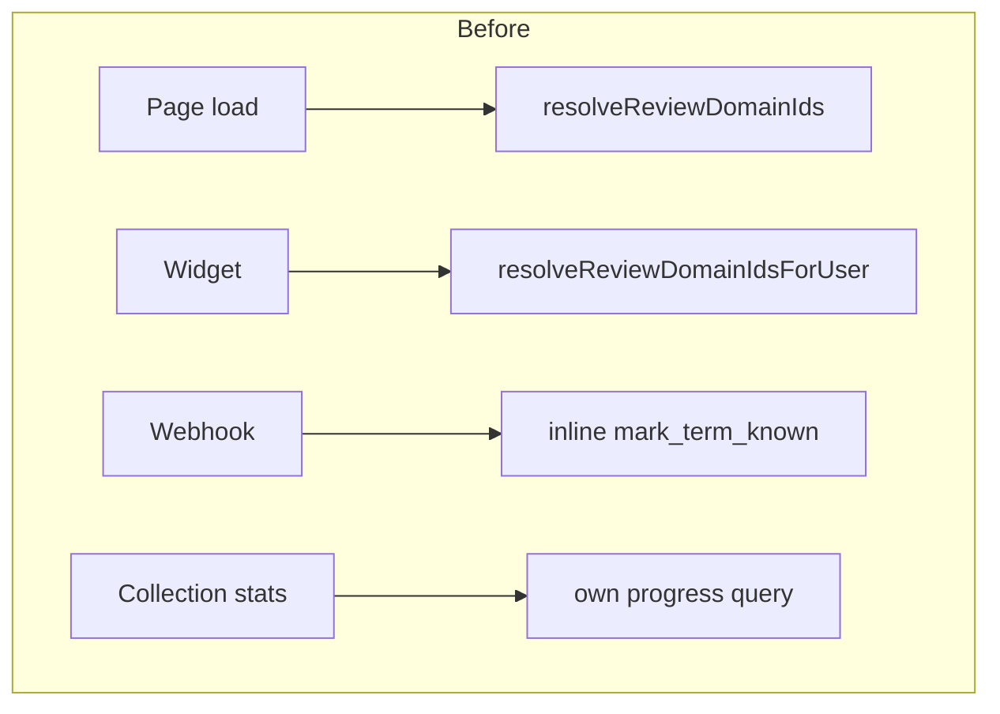
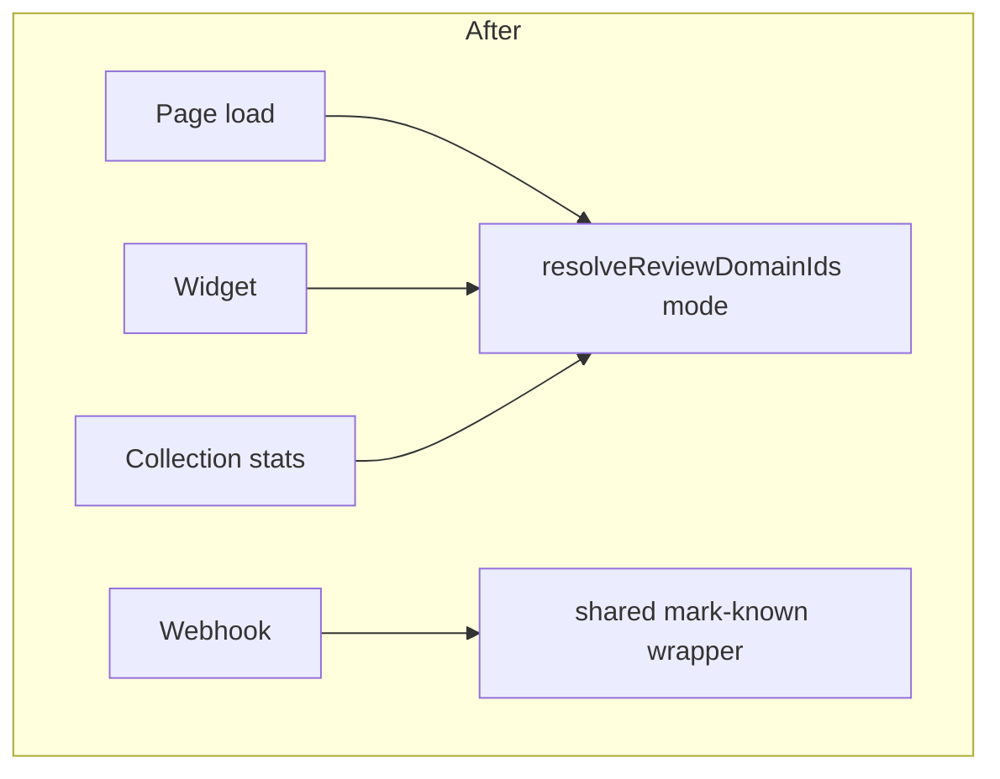
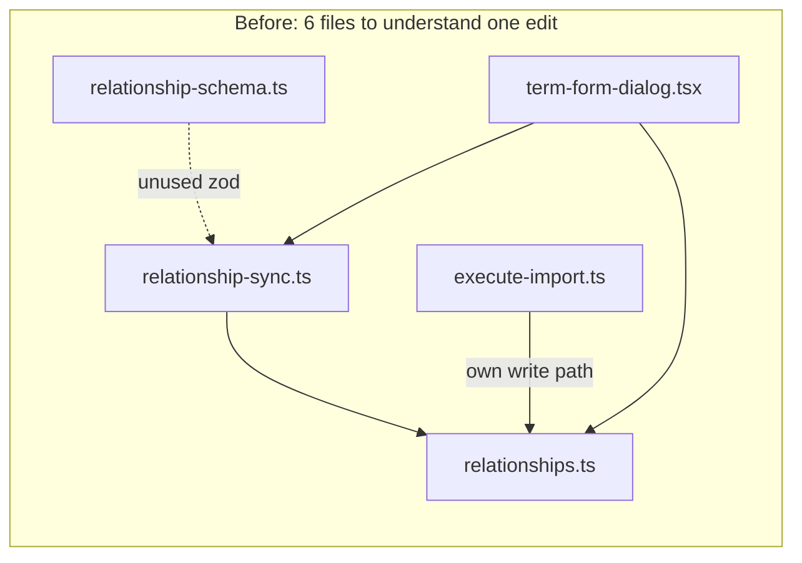
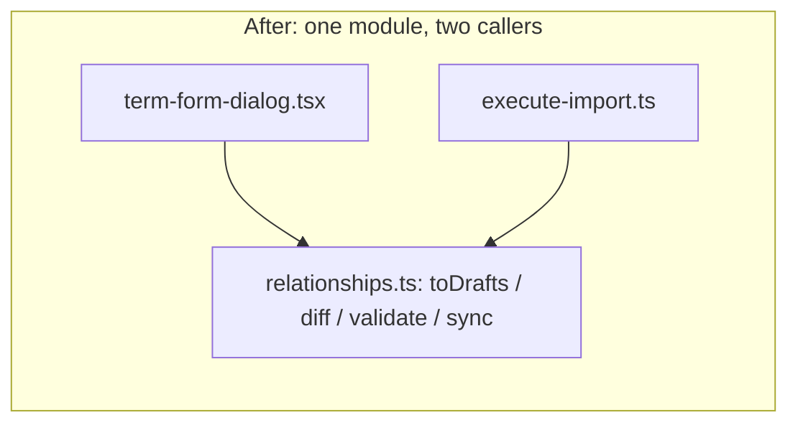
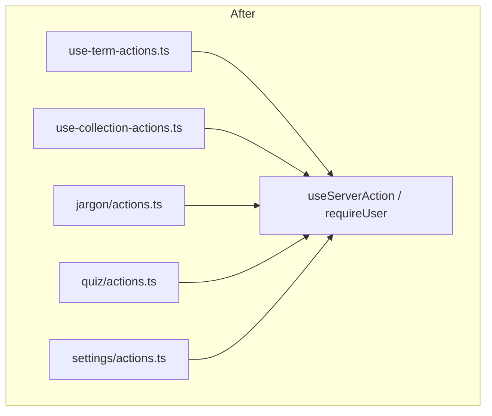

# Architecture Review — Deepening Opportunities

_Generated by an architecture pass over recent hotspots: jargon import, telegram integration, term relationships, settings, and the data layer._

No `CONTEXT.md` or `docs/adr/` exist yet in this repo, so this review uses generic architecture vocabulary (module, interface, depth, seam, locality) rather than project-specific domain terms. If you want future reviews to speak the app's own language, consider starting a `CONTEXT.md`.

**Deletion test used throughout:** would deleting this module concentrate complexity elsewhere (real depth), or just make it disappear (shallow wrapper)?

---

## Candidate 1 — Unify the "known-state" / review-pool API

**Recommendation strength: Strong**

**Files:**

- `lib/jargon/known-state.ts`
- `supabase/functions/telegram-webhook/index.ts` (L114–119)
- `lib/jargon/widget-projection.ts`
- `lib/jargon/collections.ts` (L78–92, `fetchDomainStats`)

**Problem:**
"Marking a term known" and "resolving which domains are due for review" each have two near-identical code paths instead of one:

```70:88:lib/jargon/known-state.ts
export async function resolveReviewDomainIds(client, userId) {
  // … my_review_domain_ids (session)
}
export async function resolveReviewDomainIdsForUser(client, userId) {
  // … telegram_review_domain_ids (service role)
}
```

Same shape, different RPC name, called from different consumers (page/quiz vs widget). Separately, the Telegram webhook calls `mark_term_known` inline (edge function, L114–119) instead of going through the same conceptual API as `markTermKnownForUser` — there's no single place a future engineer can look to find "everything that happens when a term is marked known." And `fetchDomainStats` in `collections.ts` computes progress with its own query rather than reusing the known-state module, so "how many terms does a user know" is answered by two different code paths that can drift.

**Solution:**
Collapse the two resolver pairs into one parameterized function (`resolveReviewDomainIds(client, userId, { mode: "session" | "service" })`), and route `fetchDomainStats`'s progress calculation through the same known-state primitives. On the Deno side, add a thin wrapper in `_shared/term-service.ts` that mirrors the Next `markTermKnownForUser` name/shape, so both runtimes present the same conceptual interface even though they can't literally share code across Node/Deno.

**Benefits:**
Locality improves: anyone changing what "known" means (e.g. adding a side effect, a new state, or an audit log) has one seam to touch per runtime instead of three. Testing improves too — a single `resolveReviewDomainIds` can be tested once with a `mode` parameter instead of two near-duplicate implementations that could silently diverge.

**Before / after:**





---

## Candidate 2 — Collapse term relationships into one deep module

**Recommendation strength: Strong**

**Files:**

- `lib/jargon/relationship-schema.ts` (29 lines)
- `lib/jargon/relationships.ts` (95 lines)
- `lib/jargon/relationship-sync.ts` (94 lines)
- `components/jargon/term-relationships-editor.tsx`
- `components/jargon/term-form-dialog.tsx` (L100–126, L215–221)
- `lib/jargon/import/execute-import.ts` (L113–153)

**Problem:**
Relationship logic is spread across three lib files with a weak center. `relationship-schema.ts` defines a Zod schema (L3–7) that is **never used to parse anything** — only its inferred types escape, making the file itself a shallow wrapper around a type alias. The real logic (diffing drafts into create/update/delete, validating, mapping) lives in `relationship-sync.ts`, while DB writes and a second self-relation check live in `relationships.ts`. The "no self-relations / no empty type" rule is enforced independently in three places: sync validation, the DB layer, and `validate-import.ts` (L105–110) for the import pipeline. Orchestration (calling `buildRelationshipSync` then `createTerm`/`updateTerm`) lives in the form dialog rather than in a relationship module, so understanding "what happens when I edit a relationship" requires reading six files in sequence.

**Solution:**
Merge `relationship-schema.ts`, `relationships.ts`, and `relationship-sync.ts` into one module (e.g. `lib/jargon/relationships.ts`) exposing a small deep interface: `toDrafts`, `diff`/`buildRelationshipSync`, `validate`, and `sync(client, ...)`. Either delete the unused Zod schema or actually use it to parse input at the boundary. Extract the self-relation/empty-type rule into one exported validator reused by both the relationship module and `validate-import.ts`, and expose one `ensureRelationship(client, ...)` primitive that both the import pipeline and the term editor call instead of writing relationships twice.

**Benefits:**
One rule, one place. A bug in "can a term relate to itself" gets fixed once instead of needing three coordinated fixes. The editor and form dialog become pure UI over a `relationships` interface, improving locality — the module becomes genuinely testable in isolation (call `sync()` with a fake client and drafts) rather than requiring UI-level integration tests to exercise validation.

**Before / after:**





---

## Candidate 3 — Shared mutation wrapper instead of twin action hooks

**Recommendation strength: Worth exploring**

**Files:**

- `hooks/use-term-actions.ts` (L14–36)
- `hooks/use-collection-actions.ts` (L21–42)
- `app/(private)/jargon/actions.ts` (`getAuthenticatedClient`, L27–38)
- `components/jargon/settings/actions.ts` (`getAuthenticatedUser`, L20–32)

**Problem:**
`use-term-actions.ts` and `use-collection-actions.ts` implement the same busy/error/refresh `run()` pattern almost verbatim — two files, one idea. Separately, every server-action file re-derives its own "get authenticated client/user or return a typed failure" boilerplate (`jargon/actions.ts`, `quiz/actions.ts`, `settings/actions.ts`), so the same three lines of auth-guard code are copy-pasted at the top of a dozen actions. Neither hook nor auth-guard duplication is "business logic" per se, but it means the actual mutation call sites are buried in repeated scaffolding, and a change to error handling (e.g. adding toast notifications, retry, or logging) needs to be made in every copy.

**Solution:**
Extract one `useServerAction()` (or `useAsyncAction()`) hook that owns busy/error/refresh state, and have `use-term-actions` / `use-collection-actions` become thin callers of it. On the server side, extract a single `requireUser()` / `withAuth(fn)` helper returning a typed `{ user, client } | { error }` result, used by all `actions.ts` files.

**Benefits:**
Removes duplicated scaffolding so the diff for "add a new mutation" is just the new mutation, not a new copy of busy-state plumbing. Improves testability of the auth guard — one function to unit test instead of trusting that every action file copied it correctly.

**Before / after:**

```mermaid
graph TD
  subgraph Before
  T[use-term-actions.ts own run()]
  Co[use-collection-actions.ts own run()]
  A1[jargon/actions.ts own auth guard]
  A2[quiz/actions.ts own auth guard]
  A3[settings/actions.ts own auth guard]
  end
```



---

## Candidate 4 — Narrow the import pipeline's public surface

**Recommendation strength: Worth exploring**

**Files:**

- `lib/jargon/import/{types,schema,errors,validate-import,execute-import,json-helpers,llm-prompt,sample-payload}.ts`
- `app/(private)/jargon/import/actions.ts` (L19–27, L57–65, L68–88)

**Problem:**
The import feature is split across eight small lib files for one user flow (paste JSON → preview → confirm → execute). The core logic itself is reasonably deep (`executeImport`, `parseImportJson`/`buildImportPreview` hide real complexity behind clean names), but reaching it requires knowing which of eight files owns what. The "confirm" action re-runs the full parse+preview before executing, and the "require authenticated user" failure object is copy-pasted at two call sites in `actions.ts` (L19–27 and L57–65).

**Solution:**
Keep the internal depth but shrink the public surface to two or three files (e.g. `parse.ts`, `execute.ts`, folding `json-helpers` and `sample-payload` into whichever consumes them). Introduce one `runImport(raw, { confirmReplace })` entry point that owns parse → preview → guard → execute, so `actions.ts` becomes auth-only glue calling one function. Reuse the shared `requireUser()` helper from Candidate 3 to remove the duplicated auth-failure object.

**Benefits:**
New contributors reading "how does import work" hit 2–3 files instead of 8+1. The confirm-path duplication becomes a single, testable decision inside `runImport` rather than logic implicit in how `actions.ts` calls things twice.

---

## Candidate 5 — Single source of truth for the Telegram link-token contract

**Recommendation strength: Speculative**

**Files:**

- `lib/telegram/link-token-contract.ts` (L8–14)
- `supabase/functions/_shared/link-token-contract.ts` (L8–14)

**Problem:**
The token contract (byte length, encoding, hash algorithm, TTL) is defined identically in both the Next.js app (Node) and the Deno edge function, kept in sync only by convention/comments:

```8:14:lib/telegram/link-token-contract.ts
export const TELEGRAM_LINK_TOKEN_CONTRACT = {
  tokenBytes: 32,
  tokenEncoding: "base64url",
  hashAlgorithm: "SHA-256",
  hashOutput: "lowercase-hex",
  ttlMs: 15 * 60 * 1000,
} as const;
```

If one side changes (e.g. TTL bumped for a support request) and the other isn't updated, tokens silently fail to validate — a runtime-boundary seam with no compiler or test to catch drift.

**Solution:**
Because Node and Deno can't share a runtime module directly, this is genuinely constrained — hence "speculative" rather than "strong." Options: (a) a small build/CI step that diffs the two constant files and fails if they disagree, or (b) a single JSON/YAML contract file both sides read at build time. Either turns "keep these in sync by convention" into an enforced invariant.

**Benefits:**
Turns a silent-failure class of bug (token TTL/format drift) into a build-time or CI-time error. Low code-complexity cost, but real risk reduction for an auth-adjacent boundary.

---

## Candidate 6 — Deepen the filter/list composition (lower priority)

**Recommendation strength: Speculative**

**Files:**

- `components/jargon/jargon-page.tsx` (L120–150)
- `components/jargon/jargon-filters.tsx`
- `components/jargon/toolbar.tsx`
- `components/jargon/term-list.tsx`

**Problem:**
`jargon-page.tsx` fans out a large number of filter-related props into `JargonFilters` → `SearchBar` + `CategoryChips` + `Toolbar`, each of which is a thin controlled-input wrapper with almost no behavior of its own. This is prop-drilling glue rather than a hollow abstraction with hidden bugs, so the risk here is more "noisy to read" than "hard to change safely."

**Solution:**
Let `JargonFilters` own its own search/category/sort state internally (or introduce one `TermFilterBar` component) so `jargon-page.tsx` passes a single filter-state object instead of ~15 individual props.

**Benefits:**
Mostly readability/locality — `jargon-page.tsx` shrinks and becomes easier to scan for its _real_ responsibilities (live known counts, deep-link handling, `/` focus shortcut) instead of filter plumbing.

**Note:** This is the lowest-leverage candidate in this report — flagged for completeness, not urgency.

---

## What's fine as-is (no action needed)

To avoid over-refactoring, these areas were reviewed and found appropriately shaped for their job:

- `lib/jargon/load-jargon-page-data.ts` — a genuinely deep facade hiding collection/review/known/relationship assembly behind one call.
- `lib/jargon/filter-terms.ts` — small, deep, well-tested-shape client-side filter logic.
- `components/jargon/settings/ui.tsx` and `components/jargon/import/import-ui.tsx` — look large (170–270 lines) but are intentionally shallow presentational kits (many small styled exports), not mixed-concern god components. Don't be tempted to "fix" their line count.
- The Telegram edge functions' term-picking/formatting logic (`_shared/term-service.ts`, `_shared/telegram-api.ts`) — correctly lives only in the edge runtime, not duplicated in Next.js.

---

## Top recommendation

**Start with Candidate 1 (unify the known-state / review-pool API).**

It sits at the intersection of the app, the widget, and the Telegram bot — the three surfaces users actually experience "did marking this known work correctly" through. Right now a bug fix or new rule about "known" has to be applied in up to four places (`known-state.ts` twice, the webhook, and `collections.ts`'s stats query), and nothing enforces that they stay consistent. It's also the riskiest area to leave alone: silent drift here means a user sees different progress numbers in the app vs. the widget vs. Telegram, which is a confusing, hard-to-diagnose bug class. Candidate 2 (relationships) is a close second and can follow immediately after — both are "Strong" and independent of each other, so they can be tackled in either order or in parallel.
